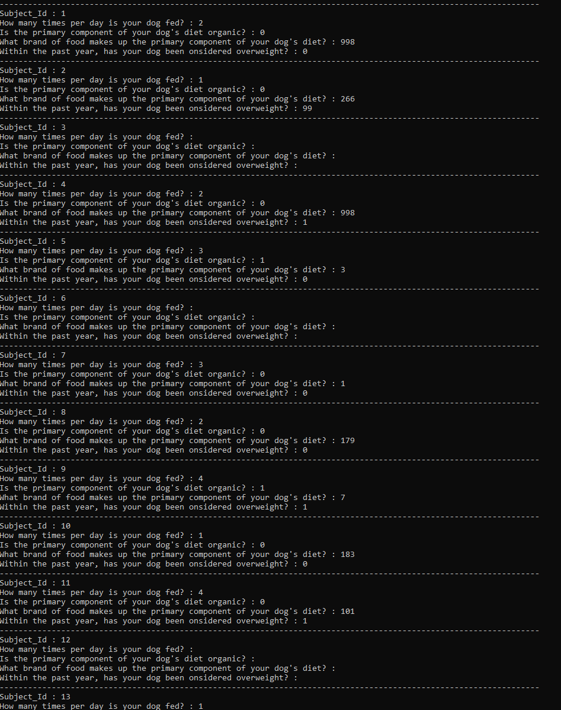
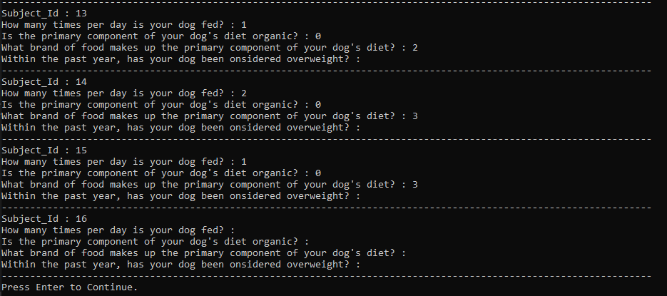

This was made using Visual Studio 2019 Community.

To run: 

- Open DAP-Exercise-B.sln in Visual Studio

- Add your api token to the request parameters in the DataService class 

- Run DAP-Exercise-B

Output: 

